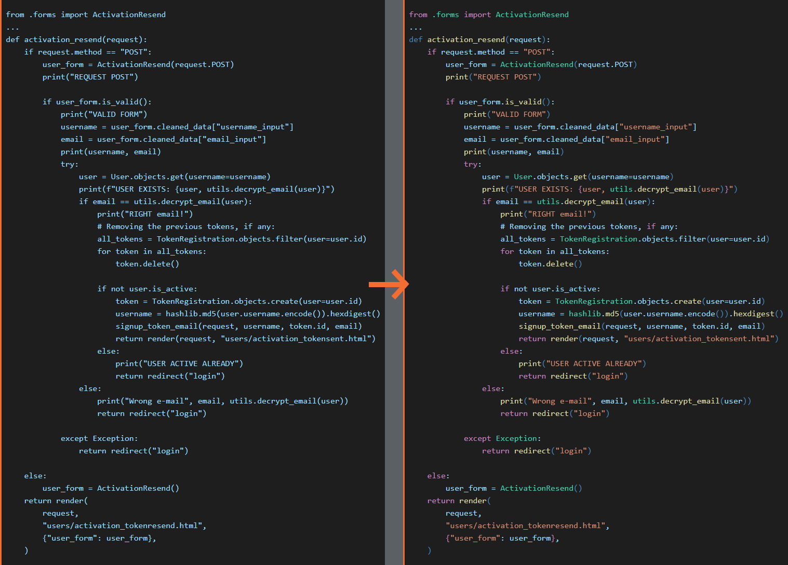

# Highlight Python Code in an HTML page (comes with a CSS)

Tired of seeing quoted code in HTML in just one plain color? Here's one solution! 🌈

Very straightforward code, nothing fancy. 🖥️

Add your code in the TXT file "code_highlights", run the script (shortcut with the "code_highlights.bat" file), and get your formatted code in "code_highlights_rendered.txt".

Don't forget to get the CSS parts that you need, or else it won't render as expected 😜

Want to help? Contact me!

This is what it looks like so far (March 1st 2024):

